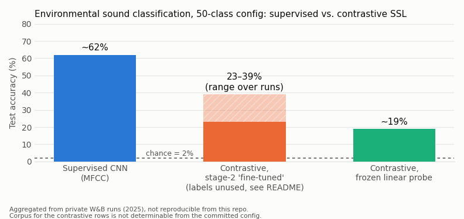

# Environmental Sound Classification: Supervised vs. Self-Supervised


The model and pipeline code was written between 14 and 23 January 2025 and is frozen;
later commits are documentation, packaging and notebook hygiene. This is a record of a
finished experiment: a supervised CNN baseline for environmental sound
classification against a COLA-style contrastive self-supervised pipeline, and an honest
account of why the self-supervised side underperformed, including a flaw in the code I
only found afterwards.

> **TL;DR.** The supervised CNN reaches ~62% test accuracy on ESC-50. The contrastive
> model, pretrained on the same small corpus, reaches ~19% with a frozen linear probe.
> Two things explain the gap: contrastive SSL needs far more unlabeled data than a
> 2,000-clip dataset gives it, and one of the two "fine-tuning" entry points
> (`main_selfsup.py`) never actually used the labels (see below).

> **Note on the numbers.** The accuracies below are aggregated from 25 private Weights &
> Biases runs and are not reproducible from this repo alone (no run artifacts committed).
> Which corpus the contrastive rows ran on cannot be settled from the committed config
> either; see "Which corpus, which config". Treat the figures as reported, not verified.

---

## Results



| Approach | Backbone / features | Test accuracy | Corpus / config, as far as the repo tells |
|---|---|---|---|
| Supervised (baseline) | Compact CNN on MFCCs | ~62% | ESC-50. `main_supervised.py` reads `audio_data/2k/esc50.csv`; `trainer_supervised.num_classes: 50`. |
| Contrastive, stage-2 "fine-tuned" (encoder unfrozen) | EfficientNet-B0 on log-mel | 23–39% | Not determinable. See the caveat below: this stage's loss ignores labels, and the repo does not record which entry point produced these runs. |
| Contrastive, frozen linear probe | EfficientNet-B0 on log-mel | ~19% | `main_finetune.py` with `freeze_encoder: True` on fold prefixes `9-`, `10-`. Corpus not determinable from the config. |
| Contrastive, pretraining pretext accuracy | n/a | 100% | `main_contrastive.py` on fold prefixes `1-` to `6-`. |

Chance level for 50 classes is 2%.

### Caveat on the 23–39% row

The repo has two "fine-tune" entry points, and they do very different things:

- `main_finetune.py` wraps the pretrained encoder in `AudioClassifier` and trains with
  cross-entropy on the class labels, with `freeze_encoder` deciding between a linear probe
  and a full fine-tune (`contrastive/models.py`, class `AudioClassifier`).
- `main_selfsup.py` wraps the same encoder in `SimCLRFineTuner`. Its loss
  (`contrastive/models.py`, `SimCLRFineTuner.contrastive_loss(self, x1, x2, labels)`,
  lines 146 to 161) receives `labels` but never uses them: it builds
  `targets = torch.arange(batch_size)` and applies cross-entropy over the view-to-view
  similarity matrix. That is plain InfoNCE with the encoder unfrozen, a second round of
  self-supervised pretraining on folds `7-`, `8-`, not supervised fine-tuning. Its
  logged "accuracy" is batch-matching accuracy, not 50-class classification accuracy.

The 23–39% row was labelled "fine-tuned (encoder unfrozen)" in my W&B notes. The repo
does not record which of the two entry points those runs used, and the committed config
group name (`contrastive_finetune_v2_frozen`) does not settle it. If they came from
`main_selfsup.py`, the number is not a classification accuracy at all. Treat the row as
unverified.

## Why self-supervision failed here

The self-supervised model implements COLA (Saeed et al., 2020, *Contrastive Learning of
General-Purpose Audio Representations*): an EfficientNet-B0 encoder trained to match two
augmented views of the same clip against other clips in the batch.

The 100% pretext accuracy is the first warning sign. The model solved its self-supervised
task perfectly, which sounds good but is the failure. On a small corpus, different clips
have very different low-level statistics (loudness, spectral envelope), so the model can
match views by cheap shortcuts instead of by semantic content. When a pretext task is that
easy, the encoder learns nothing transferable, and the frozen linear probe collapsing to
~19% against the 62% supervised baseline confirms it.

Data scale is the main cause. Contrastive SSL (COLA, SimCLR) is designed for massive
unlabeled corpora: the original COLA paper pretrains on AudioSet (about 2M clips) and
then transfers to nine downstream tasks such as TUT acoustic scenes and speech commands,
where a frozen COLA encoder averages 74% linear-probe accuracy against 29% for a random
encoder ([Saeed et al., 2020](https://arxiv.org/abs/2010.10915)). ESC-50 is not among
the paper's tasks. Pretraining on at most a couple of thousand clips and evaluating on
the same small set cannot be expected to beat plain supervised learning.

For placement: the ~62% supervised result sits just under Piczak's 2015 CNN baseline of
64.5% on ESC-50 (different protocol: a single random split here versus the leaderboard's
5-fold cross-validation), human accuracy on the set is 81.3%, and current top entries on
the [ESC-50 leaderboard](https://github.com/karolpiczak/ESC-50) exceed 98%. This was a
baseline, not a state-of-the-art attempt.

But the setup was not clean either. The stage I called "fine-tuning" (`main_selfsup.py`)
never used the labels, so the encoder went through two rounds of the same shortcut-prone
pretext task before the probe saw it. I only noticed this when re-reading the code in
2026. A supervised stage that actually used labels (cross-entropy or supervised
contrastive) might have moved the fine-tuned numbers; it would not have changed the
linear-probe result, which is the honest measure of what pretraining learned.

## Which corpus, which config

The intro says ESC-50 (2,000 clips, 50 classes, 5 folds). That is certainly true of the
supervised baseline: `main_supervised.py` reads `audio_data/2k/esc50.csv`. For the
contrastive stages the committed repo is inconsistent:

- `conf/config.yaml` points at `local_data_path: "2k"` (the ESC-50 directory) with
  `classes: 50`, but splits the data by filename prefix over ten folds: `1-` to `6-` for
  pretraining, `7-` and `8-` for the second contrastive stage, `9-` and `10-` for the
  probe. ESC-50 files are named `{fold}-{clip}-{take}-{class}.wav` with folds 1 to 5, so
  prefixes `6-` to `10-` match nothing in ESC-50.
- `data/audio_processing.py` (the wav-to-npy step) reads from `audio_data/8k/22050/`,
  an UrbanSound8K-shaped path added in commit `84e2af0` ("functionality 8k",
  2025-01-23). UrbanSound8K has 10 folds, but its filenames start with a Freesound ID,
  not a fold number, so the prefix filter would not work on it unrenamed either.

So: the supervised row is ESC-50; the contrastive rows ran on a corpus and fold scheme
that the committed code does not fully describe. My recollection is that some
contrastive and probe runs used UrbanSound8K, but that is a recollection, not something
the repo proves.

## What's in here

A PyTorch Lightning pipeline with four entry points:

- `main_supervised.py`: supervised CNN baseline on MFCC features
- `main_contrastive.py`: COLA-style contrastive pretraining (self-supervised, no labels)
- `main_selfsup.py`: second contrastive stage on the pretrained encoder (also
  self-supervised in effect; see the caveat above)
- `main_finetune.py`: linear probe or full fine-tune of the pretrained encoder with
  cross-entropy on labels

Stack: PyTorch 2.5 · PyTorch Lightning 2.5 · EfficientNet-B0 (`efficientnet-pytorch`) ·
librosa (log-mel / MFCC) · Hydra 1.3 (config) · Weights & Biases (tracking) · Google
Cloud Storage (streaming data to Colab).

## Repo structure

```
environmental_sound/
├── conf/config.yaml          # Hydra config: all hyperparameters per training mode
├── data/                     # audio -> spectrogram processing, dataloaders
├── supervised/               # CNN baseline + spectrogram transforms
├── contrastive/              # COLA encoder, SimCLRFineTuner, AudioClassifier, datasets, augmentations
├── utils/                    # GCP bucket helpers, embedding viz, misc
├── main_supervised.py
├── main_contrastive.py
├── main_selfsup.py
└── main_finetune.py
notebooks/                    # EDA + spectrogram exploration
docs/img/                     # results chart
```

## Running it

```bash
pip install -r requirements.txt

# Supervised baseline
python -m environmental_sound.main_supervised

# Self-supervised: pretrain, then probe / fine-tune
python -m environmental_sound.main_contrastive
python -m environmental_sound.main_finetune

# Second contrastive stage (loads the contrastive checkpoint; labels unused)
python -m environmental_sound.main_selfsup
```

All hyperparameters live in `environmental_sound/conf/config.yaml` (batch size,
temperature, embedding dim, freeze-encoder, learning rates, W&B project). Audio is
expected as `.npy` under `audio_data/<local_data_path>/<local_npy_dir>/` with a
`labels.csv` beside it (see `data/`). The committed fold prefixes will need adjusting to
whatever corpus you point it at (see "Which corpus, which config").

## What I'd do differently

1. Make the second stage actually supervised: cross-entropy fine-tuning of the encoder,
   or a supervised contrastive loss (SupCon) that uses the labels to define positives.
   The current `SimCLRFineTuner` is InfoNCE with a `labels` argument it never reads.
2. Keep the frozen linear probe as the primary SSL metric and run it as a proper stage:
   frozen encoder, one linear layer, no augmentation, on a fixed held-out fold.
3. Pretrain on a large unlabeled corpus (FSD50K, AudioSet), not the 2k-clip evaluation
   set. This is the single biggest lever for SSL.
4. Pin the corpus and fold scheme in one place and commit at least a metrics export per
   run, so the results table can be regenerated.
5. Watch pretext accuracy saturating at 100% as a warning sign, and harden augmentations
   before trusting the representation.

---

<sub>Original code (2025) written by me; results analysis (pulled from Weights & Biases), the 2026 code re-read, and repo cleanup done with the help of [Claude Code](https://claude.com/claude-code).</sub>
